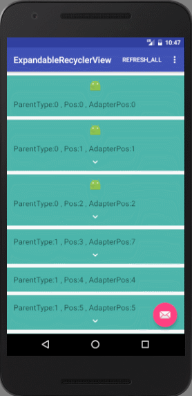

# ExpandableRecyclerView
Custom RecyclerView#Adapter that implement features like ExpandableListView

[](https://android-arsenal.com/details/1/5071)

## Demo
You can watch a short [Demo Video](https://youtu.be/KHVdrWEInBc) on YouTube and download Sample APK in [Releases](https://github.com/huajianjiang/ExpandableRecyclerView/releases) section.

## Features

* support `getParentType` and `getChildType`,support create different Parent or/and Child ItemView
* support extra `notifyParentItemMoved`、`notifyChildItemMoved`、`notifyParentItemRangeChanged`、`notifyParentItemRangedRemoved`、`notifyChildItemRangeInserted`、`notifyChildItemRangeRemoved`、`notifyChildItemRangeChanged` api
* encapsulate `ViewHolder`
* now support set specified ParentItem which can be expandable dynamically
* now support set ExpandableAdapter's `setExpandCollapseMode`! eg: MODE_SINGLE_EXPAND,in this mode,when expand another parentItem will auto collapse last expanded parentItem.

## Screenshots




## Usage
* Add a dependency to your `build.gradle`:

```grooey
dependencies {
    compile 'com.github.huajianjiang:expandablerecyclerview:1.0.9'
}
```

* or to your `pom.xml` if you are using Maven instead of Gradle:

```XML
<dependency>
  <groupId>com.github.huajianjiang</groupId>
  <artifactId>expandablerecyclerview</artifactId>
  <version>1.0.9</version>
  <type>pom</type>
</dependency>
```

## Thanks

* [bignerdranch/expandable-recycler-view](https://github.com/bignerdranch/expandable-recycler-view)

License
=======

    Copyright (C) 2015 Huajian Jiang

    Licensed under the Apache License, Version 2.0 (the "License");
    you may not use this file except in compliance with the License.
    You may obtain a copy of the License at

         http://www.apache.org/licenses/LICENSE-2.0

    Unless required by applicable law or agreed to in writing, software
    distributed under the License is distributed on an "AS IS" BASIS,
    WITHOUT WARRANTIES OR CONDITIONS OF ANY KIND, either express or implied.
    See the License for the specific language governing permissions and
    limitations under the License.
